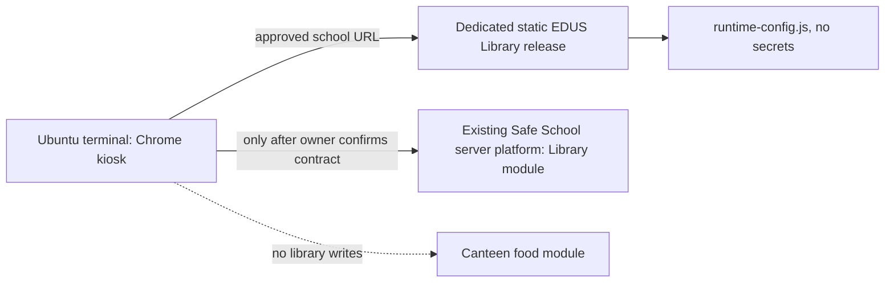

# Развёртывание: одна выбранная схема

## Подтверждённая основа и граница

В предоставленном `canteen-front-main` подтверждён только Docker/Nginx pattern: его Dockerfile копирует готовый `dist` в `nginx:alpine` и обслуживает статику на порту 8081. Он не доказывает topology Safe School server, наличие library API или право менять существующий Nginx, питание либо турникеты.

Выбранная схема для EDUS Library Terminal остаётся одной:



## Что устанавливается на сервер

### Сейчас, без library server contract

На server можно подготовить **только статический frontend package** из `release/edus-library-terminal`:

- `app/` — Vite production files;
- `config/runtime-config.js` — адреса и terminal metadata без секретов;
- `server/Dockerfile` и `server/nginx.conf` — отдельный Nginx static image, слушающий порт 8081 внутри контейнера.

Команды ниже собирают отдельный image и не меняют существующий Nginx, canteen или turnstile deployment:

```bash
cd edus-library-terminal
docker build -f server/Dockerfile -t edus-library-terminal:1.0.0 .
docker run --rm -p 8081:8081 --name edus-library-terminal edus-library-terminal:1.0.0
```

Порт, hostname, TLS, reverse proxy и постоянный запуск выбирает владелец school server. Не запускать команду рядом с занятым портом или вместо существующего canteen container без его разрешения.

### Для реальных библиотечных операций

Нужен один library module **в существующем Safe School server repository**, а не backend на терминале и не вторая база учеников. Владелец сервера должен реализовать/подтвердить shared Student/Person/Card/School integration, library tables/migrations, transaction + idempotency receipt, terminal authentication и routes. До этого `runtime-config.js` не включает write operations: production остаётся на `unavailableAdapter`.

## Что устанавливается на терминал Ubuntu

Терминал получает только release ZIP и браузерный launcher:

1. распаковать `edus-library-terminal-1.0.0.zip`;
2. выполнить `sh scripts/install.sh`;
3. указать approved static URL в `$HOME/.config/edus-library-terminal/config.env`:

```bash
EDUS_LIBRARY_URL=https://library-terminal.school.local/
```

4. выполнить `$HOME/.local/share/edus-library-terminal/scripts/diagnose.sh`;
5. открыть ярлык **EDUS Library Terminal** или `launch-library.sh`.

Launcher ищет уже установленный Chrome/Chromium и создаёт отдельный `chrome-profile` только для терминала. Он не заменяет обычный профиль Chrome, не ставит Chromium, не ослабляет browser security и не запускает Node/Vite/backend на терминале.

## Runtime configuration

`config/runtime-config.js` лежит рядом со статикой на server и содержит только non-secret values:

```js
window.__EDUS_LIBRARY_RUNTIME_CONFIG__ = Object.freeze({
  apiBaseUrl: 'https://safe-school-api.school.local',
  apiPrefix: '/api',
  language: 'ru',
  schoolId: 'school-stable-id',
  deviceId: 'library-terminal-01',
  terminalType: 'LIBRARY',
  requestTimeoutMs: { read: 8000, write: 15000, reconcile: 8000 },
})
```

Это пример структуры, а не подтверждённый URL или существующие `/library/*` routes. Credentials не добавляются в статический файл.

## Непроведённая проверка

Docker Desktop на текущем Windows workspace не стартовал, поэтому Nginx image не smoke-tested. Совместимый Ubuntu terminal, real Chrome kiosk, school LAN и hardware тоже недоступны. Их статус остаётся `not verified` в [ACCEPTANCE_REPORT.md](ACCEPTANCE_REPORT.md).
